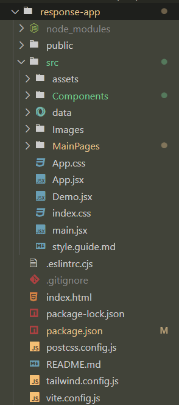

# ReachOut Connect
The porpose of creating this is share with you soon here and on linkedin too.
Are you a fresher or new to open source 🤔 join me and create something great which 
help you by gaining hands on experience. Let's cross the boundary and be a top web developer.

## This folder contains all the code related to frontend 

**folder stracture**

**UI Of Web App**

***Note: the need help button is not working because of not creating a function through which i can use that button named(Ready to help)***

**Backend**
[ReachOut Connect Backend](https://github.com/vaibhavvatsbhartiya/response-app-backend)
